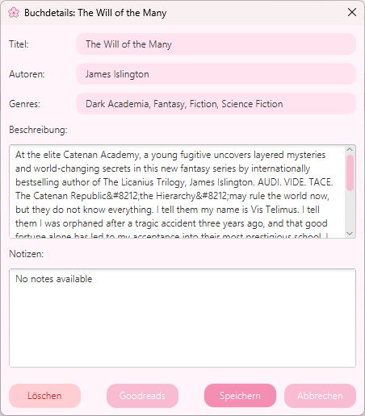

## XiaoShuGuan

### Description
#### Personal Library Desktop Application   
Manage your personal library by adding books as epub files (or not yet implemented manually).  
Edit the book title, author name, genres and book cover.  
Add your personal notes to a book. (not yet implemented)  
Track your reading progress. (not yet implemented)  
Filter your books by various categories such as author, genre (and not yet implemented reading status).  
Sort your books by various categories such as title, author, genre etc. (not yet implemented)  
Use XiaoShuGuan to load books into your kobo or tolino ereader via USB connection. (not yet implemented)  

### Preview

### Installation

### Dependencies
<a href=https://mvnrepository.com/artifact/nl.siegmann.epublib/epublib-core/3.1>epublib-core by siegmann</a>

### Usage

### Test

### Project Progress
TODO
Functional
- implement read status (+ filter)
- implement personal notes for book

- implement adding a book manually (typing info and how to deal with epub not being available)

- implement changing book cover (for export to ereader)
- implement export to ereader

Aesthetics
- change javafx default ! and ? icons of popup windows
- Add custom cursor

### Author
vanessaduldier@gmx.de

### Licence 
This project is licensed under the  
**Creative Commons Attribution–NonCommercial 4.0 International (CC BY-NC 4.0)**.

You are free to use, study, and modify this project for **non-commercial purposes only**.

Commercial use is **not permitted** without explicit permission from the author.

Note this project contains a function to add genres to a book by pasting a goodreads link of said book. Goodreads is not an open api service, so commertial use of this function is not permitted. This is merely a personal project of mine.

© 2026 Vanessa Duldier
